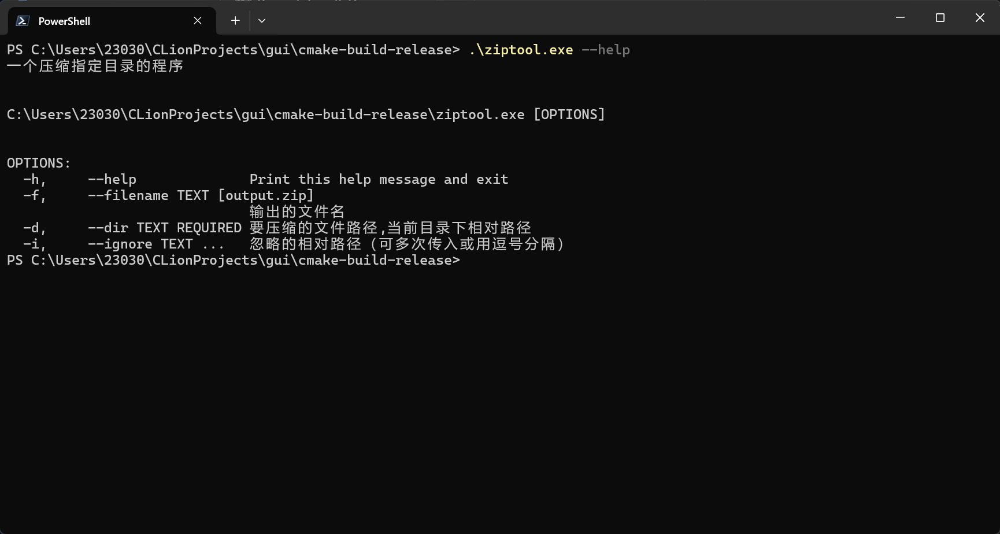

# ziptool 压缩工具



``` bash
./ziptool.exe -f "output.zip" -d "./my-app/.next/standalone -i "./next/xxx"
```

`zip` 子命令支持 `-w/--windows-style`，会在压缩包内额外套一层与压缩包同名的目录。

```bash
./ziptool.exe zip -f "ncpc-online.zip" -d "build/client" -w
```

压缩包内结构示例：

```text
ncpc-online/
ncpc-online/index.html
ncpc-online/assets/...
```
